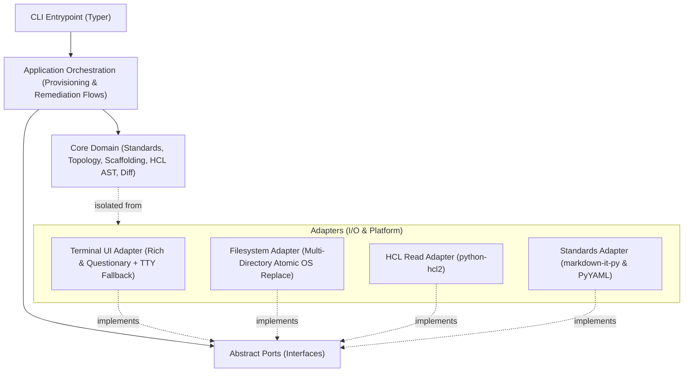

# Architecture Spine — ttassistant

## Design Paradigm

`ttassistant` follows a **Hexagonal Architecture (Ports & Adapters)** combined with an **Orchestrated Application Flow**:
- **Domain Layer (`ttassistant.domain`):** Pure Python business models, policy evaluation, subnet discovery heuristics, HCL AST modeling, and diff generation. Strictly zero I/O imports, zero terminal UI dependencies, and zero OS filesystem writes.
- **Ports Layer (`ttassistant.ports`):** Abstract interfaces (`TerminalUIPort`, `FileSystemPort`, `StandardsSourcePort`, `TweakParserPort`) defining interaction contracts.
- **Adapters Layer (`ttassistant.adapters`):** Concrete implementations (`RichTerminalAdapter`, `LocalFileSystemAdapter`, `Hcl2ParserAdapter`, `MarkdownStandardsAdapter`).
- **Application Layer (`ttassistant.application`):** Coordinates sequential user journeys (`ProvisioningFlow`, `RemediationFlow`), multi-directory staging transactions, and conversational tweak loops.



---

## Invariants & Rules

### AD-1 — Design Paradigm & Boundary Decoupling

- **Binds:** `ttassistant.domain`, `ttassistant.ports`, `ttassistant.adapters`, `FR-1`, `FR-2`, `FR-3`
- **Prevents:** Terminal UI and CLI prompt logic leaking into core infrastructure generation rules; tightly coupled untestable monolithic CLI scripts.
- **Rule:** Core domain modules (`ttassistant.domain.*`) must have strictly zero imports from `rich`, `questionary`, `prompt_toolkit`, or direct filesystem write APIs. All user interactions and I/O operations must pass through abstract interfaces in `ttassistant.ports`. 100% of domain scaffolding, AST manipulation, and standards validation must be unit-testable in memory without terminal mocks or disk fixtures.

### AD-2 — Two-Phase Discovery & Read-Only HCL Parser

- **Binds:** `ttassistant.adapters.hcl_adapter`, `ttassistant.domain.topology`, `FR-4`, `FR-5`, `FR-6`, `NFR-2`
- **Prevents:** Monorepo scan latency breaching NFR-2 (<3.0s across 10,000 files) and native C-extension compilation/ABI installation failures across diverse enterprise Linux/Windows workstations.
- **Rule:** Repository discovery must execute as a two-phase pipeline:
  1. **Phase 1 (Lexical Indexer):** Streaming regex/keyword pre-filter on `.tf` files to identify dependency candidates (`azurerm_subnet`, `azurerm_virtual_network`, `azurerm_resource_group`), ignoring `.git`, `.terraform`, and non-Terraform directories.
  2. **Phase 2 (Targeted AST Extraction):** Pure-Python AST parsing (`python-hcl2`) executed exclusively on candidate files identified in Phase 1.
  `python-hcl2` is strictly a read-only parsing adapter; round-trip AST serialization through `hcl2.dump()` is prohibited to prevent comment loss and formatting corruption.

### AD-3 — Scaffolding Module Layout, Tier 2 Scope & Offline Schema Catalog

- **Binds:** `ttassistant.domain.scaffold`, `ttassistant.adapters.hcl_emitter`, `FR-7`, `FR-10`, `FR-11`, `FR-14`
- **Prevents:** Boilerplate bloat in long-tail resource folders, state collisions, and coupled upstream dependency antipatterns (`terraform_remote_state`).
- **Rule:** Emitted files in `<resource-type>/<subscription>/` must strictly adhere to the lean decoupled layout:
  - `main.tf`: Primary resource block + Enterprise Security Triad resources (when Tier 1).
  - `data.tf`: All discovered upstream dependencies (Resource Group, Subnet, Hub Private DNS) as decoupled `data "azurerm_*"` blocks. Zero `terraform_remote_state` allowed.
  - `backend.tf`: Dedicated Azure Blob remote state backend isolated by subscription and resource type.
  Tier 2 universal resources omit `variables.tf` and `outputs.tf` by default. Scaffolding validates resource attributes against a bundled offline AzureRM schema catalog without invoking external binaries or cloud APIs.

### AD-4 — Air-Gapped Deterministic Tweak Engine with Attribute Aliasing

- **Binds:** `ttassistant.application.tweak_handler`, `ttassistant.ports.tweak_parser`, `FR-16`, `NFR-4`, `NFR-5`
- **Prevents:** Repository code or metadata leakage to external third-party AI APIs, cloud API token dependencies, and high-latency LLM roundtrips during interactive review.
- **Rule:** The default conversational tweak engine must be an air-gapped, deterministic AST attribute modifier executing locally in memory in <10ms with zero network calls and zero cloud credentials. It must utilize an AzureRM Attribute Alias Dictionary (e.g. mapping `replication` to `account_replication_type`, `tls` to `minimum_tls_version`) to resolve colloquial developer instructions. An abstract `TweakParserPort` interface wraps tweak interpretation to permit an optional enterprise-approved internal Azure OpenAI proxy adapter.

### AD-5 — Governed Agency, Surgical Remediation & Atomic Multi-Directory Writes

- **Binds:** `ttassistant.adapters.fs_adapter`, `ttassistant.domain.diff`, `FR-6`, `FR-14`, `FR-15`, `FR-16`, `NFR-6`, `NFR-7`
- **Prevents:** Silent file overwrites, existing code/comment destruction, multi-resource clobbering, partial disk corruption on interrupted writes, and unauthorized live cloud deployments (`terraform apply`).
- **Rule:** Staged HCL lives purely in memory within `StagedWorkspace`. If destination files already exist, the CLI operates in surgical remediation mode (appending new resource blocks or patching missing security attributes) without overwriting existing code or stripping comments. If scaffolding a missing dependency (e.g. missing subnet in a shared networking folder per FR-6), all affected directories are staged together. Terminal output requires explicit human confirmation `[Y]` before committing. File writes must write to hidden `.tmp` sibling files, call `os.fsync`, and atomically swap via `os.replace`. Any failure during write triggers immediate cleanup and rollback across all target directories. The CLI must never invoke `terraform apply`.

### AD-6 — Standards Engine Ingestion & Schema Specification

- **Binds:** `ttassistant.domain.standards`, `ttassistant.adapters.standards_adapter`, `FR-8`, `FR-9`, `FR-10`
- **Prevents:** Naming drifts, omitted mandatory compliance tags, and state backend collisions across monorepo subscriptions.
- **Rule:** At startup, `StandardsEngine` must parse all specification files in `common_standards/*.md` using `markdown-it-py` (for CommonMark tables and lists) and `PyYAML` (for optional YAML frontmatter) into typed Pydantic models:
  - `naming_conventions.md`: Parsed from Markdown tables (`| Resource Type | Naming Pattern | Allowed Characters | Max Length |`).
  - `tagging_baseline.md`: Parsed into mandatory tag keys and default value rules.
  - `backend_mapping.md`: Parsed into subscription storage account, container, and key patterns.
  - `networking_policy.md`: Parsed into Hub Private DNS Zone resource IDs and candidate subnet patterns.
  If `common_standards/` is missing or contains invalid syntax, the CLI must terminate immediately with exit code 1 and an actionable error message.

### AD-7 — Automated Enterprise Security Triad Bundling for PaaS

- **Binds:** `ttassistant.domain.scaffold`, `FR-12`, `FR-13`
- **Prevents:** Naked PaaS resources, public network exposures, and unlinked private DNS zones.
- **Rule:** For any Tier 1 Azure PaaS resource, the scaffolding engine must enforce the complete triad:
  1. Set `public_network_access_enabled = false` (or resource equivalent) in the primary resource block.
  2. Scaffold an `azurerm_private_endpoint` block referencing the selected target subnet data source.
  3. Scaffold a `private_dns_zone_group` block linked to the corporate Hub Private DNS Zone data source.
  Any explicit user override to enable public access must trigger an interactive security confirmation warning.

---

## Consistency Conventions

| Concern | Convention |
| :--- | :--- |
| **Naming (Domain Entities)** | PascalCase for domain entities (`SubnetCandidate`, `HclResourceBlock`, `NamingRule`, `StagedWorkspace`); snake_case for functions and methods. |
| **Naming (Files & Modules)** | snake_case for all Python modules (`provisioning_flow.py`, `hcl_adapter.py`). |
| **Data & Formats (HCL)** | Emitted Terraform files follow standard 2-space indentation, aligned attribute equals signs, and canonical block structures. |
| **Data & Formats (Errors)** | Domain exceptions inherit from `TTAssistantError`; CLI catches and formats user-friendly error banners without raw stack traces unless `--debug` is specified. |
| **State & Staged Workspace** | In-memory `StagedWorkspace` caches proposed file buffers with automatic cache invalidation upon conversational tweak mutations. |
| **Terminal & Encoding Fallback** | Streams are configured to UTF-8; ASCII fallback glyphs (`>` instead of `»`, `[x]` instead of `✔`) are used on Windows non-UTF-8 code pages. When running in non-TTY or `TERM=dumb`, interactive prompts degrade gracefully to plain text line inputs or fail-fast with guidance. |
| **Cross-Platform Pathing** | All internal path manipulations use `pathlib.Path` with POSIX-style normalization for Terraform HCL forward slashes. |

---

## Stack

| Name | Version |
| :--- | :--- |
| **python** | `3.10+` |
| **typer** | `>=0.12.5` |
| **rich** | `>=13.7.0` |
| **questionary** | `>=2.0.1` |
| **python-hcl2** | `>=8.1.0` |
| **markdown-it-py** | `>=3.0.0` |
| **pyyaml** | `>=6.0.1` |
| **pydantic** | `>=2.8.0` |
| **hatchling** | `>=1.25.0` |

---

## Structural Seed

### Operational & Environmental Envelope
- **Distribution:** Packaged as an enterprise Python wheel (`.whl`) and hosted on the internal corporate artifact repository (Artifactory / Azure Artifacts). Pre-built wheels with binary dependencies (`pydantic-core`, `regex`) are mirrored for `manylinux` and `win_amd64`.
- **Runtime Environment:** Runs inside VSCode integrated terminal on Windows (PowerShell 7+, CMD) and Linux (Ubuntu 20.04+, RHEL 8+, Debian 11+) under Python 3.10, 3.11, or 3.12.
- **External Dependencies:** Strictly zero local binary dependencies (`terraform`, `az` CLI not required on `PATH`). Zero live cloud ARM REST API calls; operates entirely against local Git repository files.

### Minimal Source Tree

```text
ttassistant/
├── pyproject.toml             # PEP 621 build configuration via Hatchling
├── ttassistant/
│   ├── __init__.py            # Package root & version
│   ├── __main__.py            # Module entrypoint (python -m ttassistant)
│   ├── cli.py                 # Typer CLI commands & argument parsing
│   ├── data/                  # Bundled offline provider schema catalog
│   │   └── azurerm_schema.json # Extracted AzureRM resource metadata & required args
│   ├── domain/                # Pure business logic (zero external I/O)
│   │   ├── __init__.py
│   │   ├── models.py          # Pydantic models (Resource, Subnet, Rule, StagedWorkspace)
│   │   ├── standards.py       # StandardsEngine (evaluates naming, tags, backend)
│   │   ├── topology.py        # TopologyIndex (candidate subnet discovery)
│   │   ├── scaffold.py        # Tier 1 & Tier 2 synthesis & Security Triad
│   │   ├── hcl.py             # Pure-Python HCL AST model, attribute aliases & serializer
│   │   └── diff.py            # Unified diff generator
│   ├── application/           # Application orchestration
│   │   ├── __init__.py
│   │   ├── provisioning_flow.py # Interactive guided dialogue flow
│   │   ├── remediation_flow.py  # Existing folder remediation flow
│   │   └── tweak_handler.py     # Deterministic conversational tweak engine
│   ├── ports/                 # Abstract interfaces (Protocols)
│   │   ├── __init__.py
│   │   ├── terminal.py        # TerminalUIPort (prompts, diffs, menus, tty detection)
│   │   ├── filesystem.py      # FileSystemPort (safe reads/atomic multi-file writes)
│   │   ├── standards_source.py # StandardsSourcePort (markdown & yaml loader)
│   │   └── tweak_parser.py    # TweakParserPort (tweak interpreter)
│   └── adapters/              # Concrete platform implementations
│       ├── __init__.py
│       ├── terminal_adapter.py # Rich & Questionary terminal implementation
│       ├── fs_adapter.py       # Atomic multi-file OS filesystem implementation
│       ├── hcl_adapter.py      # python-hcl2 read-only parser adapter
│       └── standards_adapter.py # markdown-it-py & PyYAML standards reader
└── tests/                     # Unit, integration, and ATDD test suite
```

---

## Capability → Architecture Map

| Capability / Requirement | Lives in | Governed by |
| :--- | :--- | :--- |
| **FR-1: Cross-Platform Terminal Runtime** | `ttassistant.adapters.terminal_adapter` | `AD-1`, Consistency Conventions (TTY/UTF-8) |
| **FR-2: Guided Interactive Dialogue Flow** | `ttassistant.application.provisioning_flow` | `AD-1`, `AD-5` |
| **FR-3: Zero Local Binaries Architecture** | `ttassistant.adapters.hcl_adapter`, `domain.hcl` | `AD-2`, `AD-3` |
| **FR-4: Monorepo Topology Traversal** | `ttassistant.domain.topology` | `AD-2` |
| **FR-5: Subnet & Resource Group Discovery** | `ttassistant.domain.topology`, `adapters.hcl_adapter` | `AD-2` |
| **FR-6: Collaborative Subnet Selection & Scaffolding** | `ttassistant.application.provisioning_flow` | `AD-1`, `AD-2`, `AD-5` |
| **FR-7: Decoupled Data Source Scaffolding** | `ttassistant.domain.scaffold` | `AD-3` |
| **FR-8: Dynamic Markdown Ingestion & Fail-Fast** | `ttassistant.domain.standards`, `adapters.standards_adapter` | `AD-6` |
| **FR-9: Automated Naming & Tagging Rule Enforcement** | `ttassistant.domain.standards` | `AD-6` |
| **FR-10: Automated Azure Blob Backend Mapping** | `ttassistant.domain.standards`, `domain.scaffold` | `AD-3`, `AD-6` |
| **FR-11: Tiered Azure Resource Catalog** | `ttassistant.domain.scaffold`, `ttassistant.data` | `AD-3`, `AD-7` |
| **FR-12: Mandatory Public Network Denial** | `ttassistant.domain.scaffold` | `AD-7` |
| **FR-13: Automated Private Endpoint & DNS Zone Bundling** | `ttassistant.domain.scaffold` | `AD-7` |
| **FR-14: Target Directory Scaffolding & Remediation** | `ttassistant.application.remediation_flow` | `AD-3`, `AD-5` |
| **FR-15: Unified In-Terminal Diff Display** | `ttassistant.domain.diff`, `adapters.terminal_adapter` | `AD-5` |
| **FR-16: In-Session Conversational Refinement Gate** | `ttassistant.application.tweak_handler` | `AD-4`, `AD-5` |
| **NFR-1: Cold Startup <1.5s** | `ttassistant.cli` | Minimal seed dependencies |
| **NFR-2: Repository Scan <3.0s / 10k files** | `ttassistant.domain.topology`, `adapters.hcl_adapter` | `AD-2` (Two-Phase indexing) |
| **NFR-3: Memory Footprint <150MB RSS** | All modules | Pure-Python streaming |
| **NFR-4: Zero Credential Storage** | Entire codebase | Zero cloud auth calls |
| **NFR-5: Air-Gapped Operation** | Entire codebase | `AD-4`, zero network calls |
| **NFR-6: Idempotent Scaffolding** | `ttassistant.domain.scaffold` | Deterministic template models |
| **NFR-7: Atomic Disk Writes** | `ttassistant.adapters.fs_adapter` | `AD-5` (multi-file atomic swap) |

---

## Deferred

| Decision | Reason it can wait |
| :--- | :--- |
| **AST-Level Plan Destruction Analysis** | Analyzing `terraform plan` output for resource replacement risks is deferred to v2 per PRD §6.2. |
| **Automated Batch Drift Remediation Across Legacy Folders** | Automated batch refactoring PR generation across hundreds of existing folders is deferred to v2. |
| **Multi-Cloud Provider Support (AWS / GCP)** | Scope is intentionally dedicated to Azure Terraform (`azurerm`) in v1 per PRD §5. |
| **Bi-directional Policy-as-Code Compilation** | Compiling Markdown rules into OPA/Rego/Checkov policies is an enterprise roadmap enhancement deferred to v2. |
