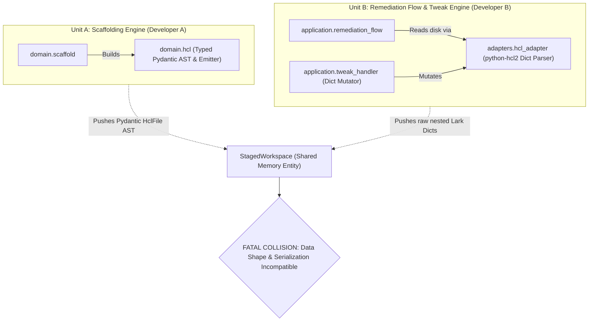

# Adversarial Architecture Review — ttassistant

**Target:** `ARCHITECTURE-SPINE.md` (Version: 2026-09-21, Status: `draft`)  
**Reviewer Role:** Adversarial Architecture Reviewer  
**Date:** 2026-09-21  
**Verdict:** **NEEDS_ATTENTION**

---

## 1. Executive Summary

The Architecture Spine for `ttassistant` establishes solid macroscopic principles: Hexagonal boundary isolation (`AD-1`), two-phase monorepo indexing (`AD-2`), atomic filesystem transactions (`AD-5`), and an air-gapped posture (`AD-4`). 

However, when probed from an adversarial perspective—simulating independent developers implementing components one level down from the architectural decisions—critical structural loopholes, data shape collisions, and state-mutation paradoxes emerge. Most notably:

1. **The HCL AST & Serializer Representation Gap:** `AD-2` mandates `python-hcl2` for AST extraction, but `python-hcl2` is strictly a read-only Lark-based parser outputting raw Python dictionaries with zero HCL writing or formatting capability. Two units implementing scaffolding and remediation will construct fundamentally incompatible representations of "HCL AST".
2. **The Greenfield vs. Multi-Resource Overwrite Hazard:** `AD-3` enforces a directory layout of `<resource-type>/<subscription>/` (`main.tf`, `data.tf`, `backend.tf`), while `AD-5` dictates that greenfield files diff against an empty buffer and atomically replace target files via `os.replace`. If an engineer provisions a second instance of a resource type in the same subscription, the scaffolding flow will either clobber the existing resource or fail catastrophically.
3. **The Air-Gapped Tweak Engine Semantic Impossibility:** `AD-4` demands an air-gapped deterministic AST attribute modifier running in `<10ms` without cloud credentials or network calls, while `FR-16` showcases colloquial natural language prompts (*"Change replication to GRS"*). Without a comprehensive provider schema mapper or NLP parser, a deterministic string/AST modifier cannot bridge natural language to provider attribute keys (`account_replication_type = "GRS"`).
4. **Missing Markdown Schema Contract:** `AD-6` requires parsing `common_standards/*.md` via `markdown-it-py` into Pydantic models but specifies no syntax specification (tables, lists, frontmatter), making the contract between platform rule authors and the domain standards engine entirely undefined.

---

## 2. Adversarial Construction: Two Units Built Incompatibly

To demonstrate the vulnerability of the current spine, we construct two separate units one level down, implemented by two independent senior developers (Developer A and Developer B). Both developers follow every Architectural Decision (AD) to the letter, yet their units cannot integrate, corrupt user configurations, and break core functional requirements.



### 2.1 The Two Units

- **Unit A: Scaffolding Engine (`ttassistant.domain.scaffold` & `ttassistant.domain.hcl`)**
  - **Governing ADs:** `AD-1` (Pure domain), `AD-3` (Decoupled layout), `AD-7` (Security triad), Consistency Conventions (2-space indentation, aligned equals).
  - **Developer A's Implementation:**
    - Develops strongly typed Pydantic models in `ttassistant.domain.hcl`: `HclFile`, `HclBlock`, `HclAttribute`, `HclExpression`.
    - Creates a pure-Python string serializer in `domain.hcl` that emits pristine, canonically formatted HCL strings with aligned `=` signs.
    - Represents generated files in `StagedWorkspace` as a map of `dict[Path, HclFile]`.

- **Unit B: Remediation Flow & Conversational Tweak Engine (`ttassistant.application.remediation_flow` & `ttassistant.application.tweak_handler`)**
  - **Governing ADs:** `AD-1` (Decoupling), `AD-2` (`python-hcl2`), `AD-4` (Air-gapped AST modifier), `AD-5` (`StagedWorkspace` & `difflib`).
  - **Developer B's Implementation:**
    - Follows `AD-2` which explicitly designates `python-hcl2` as the AST parser.
    - Ingests existing `.tf` files using `adapters.hcl_adapter` (`python-hcl2.load()`), which parses HCL into raw nested Python dictionaries:
      ```python
      {
          "resource": [
              {"azurerm_storage_account": {"sa": {"name": "...", "account_tier": "Standard"}}}
          ]
      }
      ```
    - Follows `AD-4` by treating this dictionary tree as the "AST" and modifies attributes in-place (e.g. `res["account_tier"] = "Premium"`).
    - Represents files in `StagedWorkspace` as raw dictionary trees or attempts to deserialize strings on demand.

---

### 2.2 Points of Incompatibility and Failure

#### Point 1: Data Shape Collision in `StagedWorkspace`
`AD-5` states that *"Staged HCL lives purely in memory within `StagedWorkspace`."*
- Developer A populates `StagedWorkspace` with typed `HclFile` domain entities.
- Developer B populates `StagedWorkspace` with raw `python-hcl2` dictionary structures (or expects `dict[Path, str]`).
- **The Crash:** When the user initiates a conversational tweak during a greenfield scaffolding session (`UJ-1`, Step 7), `application.tweak_handler` (Unit B) receives `StagedWorkspace` from `application.provisioning_flow` (Unit A). Unit B attempts dictionary key lookups (`ast["resource"]`) on Unit A's `HclFile` object, immediately raising an unhandled `TypeError` or `KeyError`.

#### Point 2: The Lossy HCL AST Serialization Catastrophe
- `python-hcl2` is a unidirectional parser based on Lark. It parses HCL syntax into JSON-compatible Python dictionaries.
- It **does not preserve**:
  1. HCL comments (`#` or `//`).
  2. Formatting, line breaks, or indentation.
  3. Original block ordering.
  4. Distinctions between variable references (`var.foo`), local expressions (`local.bar`), and string literals (`"var.foo"`).
- When Unit B (Remediation Flow) reads an existing file from disk, inspects it for missing mandatory tags or public network denial (`FR-14`), and attempts to emit the modified file:
  - Unit B must convert its modified dictionary back to text to compute `difflib.unified_diff` per `AD-5`.
  - Because `python-hcl2` has no AST writer/serializer, Unit B either uses an ad-hoc dictionary dumper or attempts to use Unit A's `HclFile` serializer.
  - Converting the dictionary back to HCL obliterates every existing developer comment in the file, reformats the entire file, and replaces variable references with raw string syntax.
  - The resulting unified diff shown to the user (`FR-15`) contains 300+ line deletions and additions across the entire file instead of a 3-line surgical addition. This directly violates `NFR-6` (Idempotency) and destroys user trust in Governed Agency (`AD-5`).

#### Point 3: The Multi-Resource Clobbering Trap (State-Mutation Conflict)
- `AD-3` mandates: *"Emitted files in `<resource-type>/<subscription>/` must strictly adhere to the lean decoupled layout: `main.tf`, `data.tf`, `backend.tf`."*
- `AD-5` mandates: *"For greenfield files, diffs are computed against an empty buffer... File writes must write to hidden `.tmp` sibling files, call `os.fsync`, and atomically swap via `os.replace`."*
- Consider Elena (`UJ-1`):
  1. Day 1: Elena scaffolds the first SQL server in `payments-prod`. Unit A writes `azurerm_mssql_server/payments-prod/main.tf` containing `resource "azurerm_mssql_server" "sql_001"`.
  2. Day 2: Elena runs `ttassistant` to scaffold a second SQL server (`sql_002`) in `payments-prod`.
  3. Unit A treats this as greenfield resource scaffolding. Destination path is `<resource-type>/<subscription>/` (`azurerm_mssql_server/payments-prod/`).
  4. Unit A computes the diff against an empty buffer.
  5. Unit A writes to `.tmp` and executes `os.replace`.
- **The Disaster:** Elena's first SQL server (`sql_001`) is completely overwritten and permanently deleted from disk. Furthermore, because `AD-3` isolates `backend.tf` by resource type and subscription without workload distinction, both resources shared the same Azure Blob state key (`azurerm_mssql_server/payments-prod/terraform.tfstate`). If applied, Terraform would execute a resource destruction of `sql_001`!
- The spine fails to specify how `<resource-type>/<subscription>/` accommodates multiple instances of the same resource type:
  - Does the path include workload name (`<resource-type>/<subscription>/<workload>/`)?
  - Or must Unit A parse existing `main.tf` and append new blocks? If it appends, it is no longer a greenfield operation diffing against an empty buffer, contradicting `AD-5`.

---

## 3. Comprehensive Inventory of Architectural Loopholes & Ambiguities

### Finding 1: The `python-hcl2` Read-Only Parser vs. AST Emitter Dilemma
- **Bound Artifacts:** `AD-2`, `AD-3`, `AD-4`, `domain/hcl.py`, `adapters/hcl_adapter.py`.
- **Classification:** Architectural Contradiction / Missing Capability.
- **Description:** `AD-2` mandates `python-hcl2` to prevent C-extension binary compilation. However, `python-hcl2` is strictly a parser, not a round-trip AST tool. In contrast, `AD-4` specifies a "deterministic AST attribute modifier" and minimal source tree specifies `domain/hcl.py` as a "Pure-Python HCL AST model & serializer", while `AD-3` binds an unspecified `adapters.hcl_emitter`.
- **Risk:** Without an explicit specification for how HCL is parsed, manipulated, and re-emitted:
  - Domain developers will build disparate AST models incompatible with adapter parser outputs.
  - Round-trip AST modification on existing files is mathematically impossible with `python-hcl2` without losing comments and code layout.

---

### Finding 2: Unspecified Ingestion Grammar for `common_standards/*.md`
- **Bound Artifacts:** `AD-6`, `FR-8`, `FR-9`, `FR-10`.
- **Classification:** Critical Ambiguity / Schema Vacuum.
- **Description:** `AD-6` specifies that `StandardsEngine` parses `common_standards/*.md` using `markdown-it-py` into typed Pydantic models at startup. `FR-8` mentions tables, key-value lists, and YAML frontmatter. However, the spine defines zero specification for:
  - Markdown table header schemas (e.g. What column names are required?).
  - Section header conventions (e.g. Does `# Storage Accounts` map to `azurerm_storage_account`?).
  - Syntax for dynamic naming regexes vs. mandatory tags vs. backend storage parameters.
- **Risk:** If the platform engineering team writes a standard in natural language bullet points (`- Storage account names must begin with st and end with subscription name`), `markdown-it-py` will parse the tokens, but the Pydantic parser will find no matching schema. `AD-6`'s fail-fast rule only checks if the directory is missing or empty; it will silently load zero rules, and the CLI will scaffold non-compliant resources without warning.

---

### Finding 3: Air-Gapped Tweak Parser Contract & Semantic Mapping Void
- **Bound Artifacts:** `AD-4`, `FR-16`, `ports/tweak_parser.py`, `application/tweak_handler.py`.
- **Classification:** Design Loophole / Behavioral Gap.
- **Description:** `AD-4` mandates an air-gapped deterministic AST attribute modifier running locally in `<10ms` with zero external calls. Yet `FR-16` and `UJ-1` present conversational tweak examples: *"Set minimum TLS version to 1.2"* and *"Change replication to GRS"*.
- **Risk:** In Terraform AzureRM:
  - "replication" maps to `account_replication_type`.
  - "minimum TLS version" maps to `min_tls_version` or `minimum_tls_version` depending on whether the resource is `azurerm_storage_account`, `azurerm_mssql_server`, or `azurerm_app_service`.
  - A deterministic modifier without an LLM cannot translate arbitrary colloquial English into Terraform attribute keys unless it bundles a full dictionary of synonyms for thousands of Azure provider attributes.
  - Furthermore, `ports/tweak_parser.py` has no defined signature. Does it return an AST mutation operation, or does it return a raw HCL patch string? An Azure OpenAI adapter would return HCL text; a deterministic modifier returns an AST command. They cannot share the same port interface cleanly.

---

### Finding 4: Missing Subnet Placement Heuristics & Discovery Contract
- **Bound Artifacts:** `AD-2`, `AD-6`, `FR-5`, `FR-6`, `domain/topology.py`.
- **Classification:** Boundary Decoupling Defect.
- **Description:** `FR-6` requires marking candidate subnets as `(Recommended)` based on `common_standards/` recommendations.
- **Risk:**
  - `AD-6` defines rules for naming regexes, mandatory tags, hub DNS zones, and state backend schemas, but omits subnet placement heuristics.
  - `domain.topology` has no defined data contract with `domain.standards`. If `TopologyIndex` parses candidate subnets from repository files, who evaluates the `(Recommended)` score?
  - Furthermore, in Terraform, subnets can be declared as separate `azurerm_subnet` resources OR inline `subnet { ... }` blocks inside `azurerm_virtual_network`. `AD-2` Phase 1 only pre-filters candidate files with regexes; if subnets are defined inline, Phase 1 may miss them or Phase 2 AST extraction will return an incompatible data structure.

---

### Finding 5: `StagedWorkspace` Ownership & Invalidation Lifecycle
- **Bound Artifacts:** `AD-1`, `AD-5`, `Consistency Conventions`.
- **Classification:** State Model Ambiguity.
- **Description:** `StagedWorkspace` is designated as the sole in-memory container for uncommitted HCL (`AD-5`), but it is omitted from the minimal source tree.
- **Risk:**
  - Is `StagedWorkspace` a Domain Model, an Application Session State, or an Adapter Buffer?
  - If a conversational tweak mutates the workspace in memory, who regenerates the diff?
  - If `StagedWorkspace` caches serialized HCL strings for `difflib` alongside AST nodes, what prevents state desynchronization between the AST and the rendered diff?

---

## 4. Prioritized Recommendations for Architecture Spine Hardening

To bring the Architecture Spine from `NEEDS_ATTENTION` to `PASS`, the following concrete adjustments should be incorporated into `ARCHITECTURE-SPINE.md`:

| Priority | Area | Required Architectural Modification |
| :--- | :--- | :--- |
| **P0** | **HCL AST & Serialization (`AD-2`, `AD-3`)** | Define a single canonical domain representation for HCL. Formally specify that `adapters.hcl_adapter` uses `python-hcl2` for read-only topology discovery, but specify the exact tool/engine used for scaffolding synthesis and AST manipulation in `domain/hcl.py` (e.g. a dedicated CST/AST model or Jinja2 template scaffolding paired with regex/token-based AST surgical injection). |
| **P0** | **Directory Tenancy & Multi-Instance Layout (`AD-3`)** | Clarify the directory structure in `AD-3`. Specify whether directories are `<resource-type>/<subscription>/<workload-name>/` or if `<resource-type>/<subscription>/` supports multiple resources via AST block-merging. |
| **P1** | **`common_standards/` Grammar Specification (`AD-6`)** | Add an explicit standard grammar specification (e.g. YAML frontmatter for machine rules + Markdown body for human documentation) to ensure deterministic parsing by `StandardsEngine`. |
| **P1** | **Tweak Engine Contract & Port Interface (`AD-4`)** | Define the exact interface for `TweakParserPort`. For the deterministic air-gapped engine, specify a strict command grammar (e.g. `set <attribute> = <value>` or `tag <key> = <value>`) and clearly delineate what natural language capabilities require the optional OpenAI adapter. |
| **P2** | **`StagedWorkspace` Domain Definition (`AD-5`)** | Formally add `StagedWorkspace` to `ttassistant/domain/models.py` with an immutable file dictionary structure and an explicit dirty-state cache invalidation lifecycle. |

---

## 5. Review Conclusion

The Architecture Spine has exceptional clarity regarding high-level governance and non-functional boundaries, but contains critical ambiguities in data structures, AST serialization, and multi-resource directory mutation that would cause independently developed units to collide catastrophically.

Addressing the P0 items identified above will establish a bulletproof substrate for downstream epic creation and implementation.
