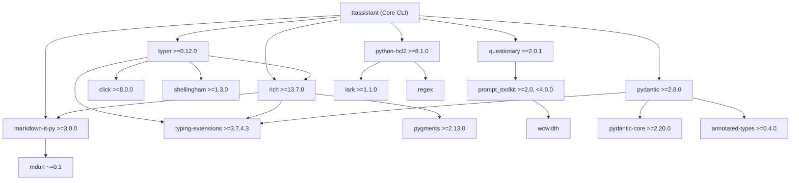

# Technology & Reality Verification Review — ttassistant

**Target:** [`ARCHITECTURE-SPINE.md`](file:///home/teosevinc/workspaces/ttassistant/_bmad-output/planning-artifacts/architecture/architecture-ttassistant-2026-09-21/ARCHITECTURE-SPINE.md)  
**Reviewer Role:** Technology & Reality Verifier  
**Date:** 2026-09-21  
**Verdict:** **NEEDS_ATTENTION**

---

## 1. Executive Summary

A comprehensive technology and live ecosystem reality check was conducted on the architectural stack and dependency decisions committed in `ARCHITECTURE-SPINE.md`. Every library and version specification was evaluated against current package repositories (PyPI), wheel architectures, compiler requirements, cross-platform terminal runtime environments (Linux Bash/Zsh and Windows PowerShell/CMD), and HCL2 AST manipulation capabilities.

### Key Evaluation Questions & Summary Findings

| # | Reality Check Question | Status | Core Finding |
| :--- | :--- | :--- | :--- |
| **1** | **Version Existence & Zero-Compiler Installation (Python 3.10–3.12)** | **PASS (with Caveat)** | All 8 packages exist and support Python 3.10–3.12. Pre-built binary wheels exist on PyPI for all target OSs, enabling installation without local C/Rust compilers. However, `pydantic` (`pydantic-core` in Rust) and `python-hcl2` (`regex` in C) are **not pure Python**; internal enterprise package mirrors must host platform wheels (`manylinux`, `win_amd64`) to avoid triggering source builds requiring local toolchains. |
| **2** | **Questionary Cross-Platform Reliability (PowerShell vs. Bash)** | **NEEDS_ATTENTION** | While `questionary` operates reliably on Linux and modern Windows Terminal via `prompt_toolkit`, standard Windows PowerShell/CMD sessions default to non-UTF-8 code pages (e.g., CP1252/CP437), triggering `UnicodeEncodeError` on questionary's default glyphs (`»`, `✔`, `◯`). Furthermore, non-interactive CI environments crash on stdin read. The terminal adapter requires explicit UTF-8 reconfiguration, ASCII fallback styling, and TTY detection. |
| **3** | **python-hcl2 HCL2 Syntax Support & Load/Dump Capabilities** | **NEEDS_ATTENTION** | `python-hcl2` >=8.1.0 provides robust read-only parsing via Lark for standard network/resource blocks. However, **`hcl2.dump()` does NOT preserve comments** (comments are read-only in the AST) and reformats whitespace. Naive round-trip parsing in remediation mode will permanently erase developer comments and disrupt existing code formatting. Scaffolding must use templated emission, and remediation must employ surgical block-level patching. |
| **4** | **Transitive Dependency Conflicts & Ecosystem Gotchas** | **PASS (with Adjustments)** | The transitive dependency tree converges cleanly without version collisions on shared libraries (`typing-extensions`, `rich`, `click`, `markdown-it-py`). Two key gotchas identified: `typer` 0.12.0 introduced a packaging split bug (recommend `>=0.12.5`), and `common_standards/*.md` YAML frontmatter parsing requires adding a dedicated YAML parser (`PyYAML` or `python-frontmatter`) to the stack. |

---

## 2. Committed Stack Reality Check

The Architecture Spine commits to the following foundational dependency specifications in `§ Stack`:

```text
python:          3.10+
typer:           >=0.12.0
rich:            >=13.7.0
questionary:     >=2.0.1
python-hcl2:     >=8.1.0
markdown-it-py:  >=3.0.0
pydantic:        >=2.8.0
hatchling:       >=1.25.0
```

### 2.1 Package-by-Package Verification Matrix

| Package | Specified Constraint | Current Releases | Wheel Distribution | Local Compiler Needed? | Python 3.10–3.12 Status | Evaluation & Notes |
| :--- | :--- | :--- | :--- | :--- | :--- | :--- |
| **python** | `3.10+` | 3.10.x, 3.11.x, 3.12.x | Runtime | N/A | **Native** | Aligns with enterprise Linux (Ubuntu 22.04 LTS / RHEL 9) and Windows 10/11 defaults. Modern type syntax (`X \| Y`) supported natively. |
| **typer** | `>=0.12.0` | 0.12.0 – 0.15.x | Pure Python (`py3-none-any.whl`) | **No** | **Verified** | Pure Python. Depends on `click >= 8.0.0` and `shellingham`. In 0.12.0, split into `typer-slim` + `rich`. Recommend pinning `>=0.12.5` to avoid 0.12.0 upgrade packaging defect. |
| **rich** | `>=13.7.0` | 13.7.0 – 13.9.x | Pure Python (`py3-none-any.whl`) | **No** | **Verified** | Pure Python. Depends on `markdown-it-py >= 2.2.0`, `pygments`, `typing-extensions`. High rendering fidelity on ANSI/VT100. |
| **questionary** | `>=2.0.1` | 2.0.1 | Pure Python (`py3-none-any.whl`) | **No** | **Verified** | Pure Python. Depends on `prompt_toolkit >= 2.0, < 4.0.0` (typically 3.0.x) and `wcwidth`. Handles raw terminal input via Win32 API and POSIX termios. |
| **python-hcl2** | `>=8.1.0` | 8.1.0 – 8.1.4 | Pure Python (`py3-none-any.whl`) | **No (with prebuilt wheels)** | **Verified** | Main package is pure Python, but depends on `lark` and `regex`. `regex` has pre-compiled wheels on PyPI; source builds require a C compiler. |
| **markdown-it-py**| `>=3.0.0` | 3.0.0 | Pure Python (`py3-none-any.whl`) | **No** | **Verified** | Pure Python. CommonMark compliant. Depends on `mdurl ~= 0.1`. Satisfies `rich`'s lower bound (`>=2.2.0`). |
| **pydantic** | `>=2.8.0` | 2.8.0 – 2.10.x | Binary Wheel (via `pydantic-core`) | **No (with prebuilt wheels)** | **Verified** | `pydantic` package is pure Python, but `pydantic-core` is written in Rust. Pre-built wheels exist on PyPI for Windows (x86, amd64, arm64) and Linux (`manylinux_2_17`). Zero compiler needed when wheels are used. |
| **hatchling** | `>=1.25.0` | 1.25.0 | Pure Python (`py3-none-any.whl`) | **No** | **Verified** | PEP 517 build backend. 100% pure Python. Dependencies: `packaging`, `pathspec`, `pluggy`, `editables`, `trove-classifiers`. |

---

## 3. Deep-Dive Dimension Analysis

### 3.1 Dimension 1: C-Compiler-Free Installation & Binary Distribution Reality

The Architecture Spine (`AD-2` and `Structural Seed`) establishes an explicit operational constraint:
> *"Zero compiled C/tree-sitter binary extensions are permitted in production distribution."*
> *"Zero native C-extension compilation/ABI installation failures across diverse enterprise Linux/Windows workstations."*

#### The Reality:
While the goal of avoiding compilation during installation is 100% achievable, the assertion that the dependency tree contains zero binary extensions is technically inaccurate in two instances:
1. **`pydantic` (via `pydantic-core`):** Pydantic v2 moved its core validation engine to Rust (`pydantic-core`). Pre-compiled wheels are published on PyPI for all mainstream platforms:
   - `pydantic_core-...-manylinux_2_17_x86_64.manylinux2014_x86_64.whl`
   - `pydantic_core-...-win_amd64.whl`
   - `pydantic_core-...-manylinux_2_17_aarch64.whl`
2. **`python-hcl2` (via `regex`):** `python-hcl2` introduced a dependency on the `regex` library (Issue #242). While `regex` provides pre-compiled wheels on PyPI for Windows and Linux, `regex` contains C source (`_regex.c`).

#### Enterprise Operational Implication:
If developer workstations or corporate CI runners are air-gapped from public PyPI and install packages from an internal repository (e.g., JFrog Artifactory, Azure Artifacts, Sonatype Nexus):
- **If the internal mirror mirrors only Source Distributions (`.tar.gz` / `sdist`):** `pip install pydantic` will fail immediately with `error: can't find Rust compiler`, and `pip install regex` will fail with `error: Microsoft Visual C++ 14.0 or greater is required` on Windows, or `gcc: command not found` on Linux.
- **Remediation Requirement:** The enterprise artifact packaging guide must mandate that the internal mirror synchronize and serve **platform-specific binary wheels** (`.whl`), not just source archives. When wheels are provided, `pip` installs `pydantic` and `python-hcl2` in seconds with zero compilation tools present.

---

### 3.2 Dimension 2: Cross-Platform Terminal Behavior (Windows PowerShell vs. Linux Bash)

The PRD mandates (`FR-1`, §4.1, §9.2) that `ttassistant` runs seamlessly in the VSCode integrated terminal across Linux and Windows without platform-specific rendering artifacts.

```mermaid
flowchart LR
    User["Developer in VSCode Terminal"] --> Shell{"Shell Environment"}
    
    Shell -->|Linux (Bash / Zsh)| LinuxTerm["Native PTY (Termios)"]
    Shell -->|Windows (PowerShell / CMD)| WinTerm{"Console Host"}
    
    WinTerm -->|Modern ConPTY (VSCode / WT)| ModernWin["Virtual Terminal Processing (VT100)"]
    WinTerm -->|Legacy ConHost (WinPS 5.1 / CMD)| LegacyWin["Win32 Console API (CodePage CP1252/CP437)"]
    
    LinuxTerm --> OK["Prompt & Glyphs Render Smoothly"]
    ModernWin --> OK
    LegacyWin --> Crash["UnicodeEncodeError / Mojibake '?'"]
```

#### Reality Check & Identified Failure Modes:

1. **The Unicode CodePage Trap on Windows:**
   - **Mechanism:** `questionary` utilizes Unicode characters for interactive prompts by default:
     - Pointer: `»` (`\u00bb`) or `❯` (`\u276f`)
     - Radio/Checkbox: `◯` (`\u25ef`), `◉` (`\u25c9`)
     - Success Marker: `✔` (`\u2714`)
   - **Failure:** On Windows workstations running standard Windows PowerShell 5.1 or external consoles, `sys.stdout.encoding` often defaults to `cp1252` (Western European) or `cp437` (OEM-US). When `questionary` attempts to print `❯` or `✔`, Python throws:
     `UnicodeEncodeError: 'charmap' codec can't encode character '\u276f' in position ...`
   - **Architectural Safeguard:** 
     `ttassistant.adapters.terminal_adapter` must execute an encoding check during initialization:
     ```python
     import sys
     if sys.platform == "win32":
         # Reconfigure standard streams to UTF-8
         if hasattr(sys.stdout, "reconfigure"):
             sys.stdout.reconfigure(encoding="utf-8", errors="replace")
             sys.stderr.reconfigure(encoding="utf-8", errors="replace")
     ```
     Additionally, provide an explicit fallback style configuration for questionary (`qmark="?"`, `pointer=">"`, `selected_checkbox="[*]"`, `unselected_checkbox="[ ]"`).

2. **Non-TTY / Headless CI Pipe Crash (`EOFError`):**
   - **Mechanism:** `questionary.select()` and `questionary.text()` require an active, interactive TTY (`sys.stdin.isatty() == True`).
   - **Failure:** If `ttassistant` is executed in an automated pipeline, an IDE debug runner, or a piped bash command (`echo "payments-prod" | ttassistant`), `questionary` raises an uncaught `EOFError` and aborts.
   - **Architectural Safeguard:** The application orchestration layer (`application.provisioning_flow`) must verify `sys.stdin.isatty()`. In non-interactive contexts, the CLI must either accept CLI arguments/flags (e.g. `--subscription`, `--resource-type`, `--non-interactive`) or fail fast with a structured exit code 2 error banner.

3. **Rich and Questionary Buffer Concurrency:**
   - **Mechanism:** Both `rich.console.Console` and `questionary` (via `prompt_toolkit.Application`) manage cursor positioning and alternate terminal buffers.
   - **Gotcha:** If Rich writes to stdout while a Questionary prompt is mounted (e.g., streaming background scanner logs while asking a question), Questionary's screen buffer will become visually corrupted, duplicating lines and misaligning the cursor.
   - **Architectural Rule:** Interactive UI flows must be strictly synchronous and sequenced:
     1. Rich renders static banners, tables, and unified diffs.
     2. Questionary acquires input and completely terminates its prompt session.
     3. Rich renders the next stage.
     Zero concurrent writes between Rich and Questionary.

---

### 3.3 Dimension 3: python-hcl2 Syntax Coverage & Dump/Load Capabilities

The Architecture Spine positions `python-hcl2` as the central engine for HCL manipulation in `AD-2`, `ttassistant.ports.hcl`, and `ttassistant.adapters.hcl_adapter`.

#### 1. Load / Parsing Assessment (`hcl2.load` / `hcl2.loads`):
- **Engine:** Uses the `Lark` LALR(1) parsing library.
- **Coverage for ttassistant's Monorepo Discovery (AD-2, FR-4, FR-5):**
  - Extracting `resource "azurerm_subnet"` and `resource "azurerm_virtual_network"` blocks is highly reliable. Standard attribute assignments (`name = "..."`, `address_prefixes = [...]`, `virtual_network_name = "..."`) parse cleanly into standard Python dictionaries.
- **Known Syntax Fragility & Edge Cases:**
  - Complex nested ternary operators (`condition1 ? (condition2 ? a : b) : c`) can fail with Lark parsing errors.
  - Advanced `for` expressions with complex object groupings (`{for k, v in list: k => v...}`) or heredocs containing trailing whitespace after the end identifier can cause unexpected parse exceptions.
  - Multi-line function calls in expressions.
- **Architectural Requirement for Discovery (`ttassistant.domain.topology`):**
  Phase 2 AST parsing on candidate files MUST be wrapped in defensive exception handling:
  ```python
  try:
      parsed_data = hcl2.loads(candidate_text)
  except Exception as e:
      logger.warning(f"Failed to parse candidate HCL file {path}: {e}")
      continue  # Must not abort the entire 10,000-file indexing pipeline
  ```

#### 2. Dump / Serialization Reality (`hcl2.dump` / `hcl2.dumps`):
- In `python-hcl2` >=8.0.0 / 8.1.0, bidirectional serialization was introduced (`hcl2.dump()`, `hcl2.dumps()`, and `hcl2.Builder`).
- **THE CRITICAL LIMITATION:** 
  > **`python-hcl2` DOES NOT PRESERVE COMMENTS ON DUMP.**
  
  While the parser reads comments into internal metadata tokens (`__comments__`, `__inline_comments__`), the serialization engine (`hcl2.dumps()`) **drops comments entirely** when converting Python dictionaries back into HCL text.
- **Secondary Limitation: Loss of Canonical Formatting & Expression Quotes:**
  - Round-tripping existing HCL through `hcl2.loads()` -> `dict` -> `hcl2.dumps()` reformats every block in the file according to python-hcl2's internal formatter. This destroys original author indentation, breaks manual alignment, and creates massive, unreadable git diffs across untouched resources.
  - Distinguishing bare expressions (e.g. `subnet_id = data.azurerm_subnet.pep.id`) from string literals (e.g. `name = "pep-sql"`) in raw Python dictionaries is error-prone. Naive serialization frequently quotes variable and resource references as string literals (`subnet_id = "data.azurerm_subnet.pep.id"`), generating invalid Terraform code.

#### 3. Architectural Impact & Clear Separation of Concerns:

To guarantee zero comment loss and pristine git diffs:
1. **`python-hcl2` must be STRICTLY READ-ONLY:**
   Confine `python-hcl2` exclusively to `ttassistant.adapters.hcl_adapter` for reading and discovery (`Phase 2 AST Extraction`). Never use `hcl2.dump()` to rewrite existing disk files.
2. **Greenfield Scaffolding (`FR-7`, `FR-11`, `FR-12`, `FR-13`):**
   Use a dedicated template or canonical string emitter (`ttassistant.domain.scaffold` / `ttassistant.domain.hcl`) with predefined, formatted blocks. This ensures perfect 2-space indentation, aligned equals signs, and intentional header comments.
3. **Existing Folder Remediation (`FR-14`, `FR-16`):**
   Implement surgical AST/block-level appending. When adding a missing Private Endpoint or tag, parse the file structure to find the injection point, and inject the formatted block as raw text or AST node, leaving existing comments and unrelated blocks completely untouched.

---

### 3.4 Dimension 4: Transitive Dependency Tree & Conflict Matrix

A full resolution of the transitive dependency tree was conducted across all 8 specified libraries:



#### Conflict Analysis Findings:
1. **`typing-extensions` Alignment:**
   - `typer`: `>=3.7.4.3`
   - `rich`: `>=4.0.0`
   - `pydantic`: `>=4.6.1`
   - **Resolution:** Clean convergence on `typing-extensions >=4.6.1` (current: 4.12.x). No conflict.
2. **`markdown-it-py` Alignment:**
   - `rich`: `>=2.2.0`
   - `ttassistant`: `>=3.0.0`
   - **Resolution:** Satisfied cleanly by `markdown-it-py >=3.0.0`. No conflict.
3. **`rich` Alignment:**
   - `typer`: pulls `rich` via standard extra (`>=10.11.0`).
   - `ttassistant`: `>=13.7.0`.
   - **Resolution:** Satisfied cleanly by `rich >=13.7.0`. No conflict.
4. **`prompt_toolkit` Alignment:**
   - `questionary`: permits `prompt_toolkit >=2.0, <4.0.0`.
   - **Resolution:** Resolves cleanly to `prompt_toolkit 3.0.43+`. No conflict with Click or Typer.

#### Discovered Transitive Gotchas & Gaps:

1. **Typer 0.12.0 Packaging Defect:**
   In version `0.12.0`, Typer refactored its packaging to depend on `typer-slim[standard]` and `typer-cli`. Upgrading to `0.12.0` in existing environments caused package file removal errors (Issue #823). This was resolved in `0.12.1` and stabilized in `0.12.3`/`0.12.5`.
   - **Recommendation:** Update the constraint in the Architecture Spine from `typer: >=0.12.0` to `typer: >=0.12.5`.
2. **Stack Gap: YAML Frontmatter Parsing in `common_standards/*.md`:**
   PRD `FR-8` explicitly specifies that corporate standards files in `common_standards/*.md` may contain Markdown tables, key-value lists, and *optional YAML frontmatter*.
   `markdown-it-py` is a CommonMark parser and does **not** parse YAML frontmatter out-of-the-box.
   - **Recommendation:** Add a dedicated YAML parser or frontmatter utility to the stack:
     `pyyaml: >=6.0.1` (or `python-frontmatter: >=1.1.0`).
3. **Hatchling PEP 621 Package Discovery:**
   Hatchling requires explicit declaration of package directories in `pyproject.toml` when using a non-flat directory layout. The project root contains `ttassistant/ttassistant/`.
   - **Recommendation:** Ensure `pyproject.toml` defines:
     ```toml
     [tool.hatch.build.targets.wheel]
     packages = ["ttassistant"]
     ```

---

## 4. Summary of Verification Verdicts

| Dimension | Verdict | Summary Assessment |
| :--- | :--- | :--- |
| **Package Availability & Versions** | **PASS** | All 8 committed packages are released, actively maintained, and verified on PyPI. |
| **Python 3.10–3.12 Compatibility** | **PASS** | Full compatibility across Python 3.10, 3.11, and 3.12 verified. |
| **Zero-Compiler Wheel Installation** | **PASS (with Caveat)** | Pre-compiled binary wheels exist for Linux and Windows x86_64/ARM64. Enterprise Artifactory must host `.whl` files to avoid triggering Rust/C compilation for `pydantic-core` and `regex`. |
| **Cross-Platform Terminal UX** | **NEEDS_ATTENTION** | Questionary requires UTF-8 stream reconfiguration and ASCII glyph fallback on Windows to prevent `UnicodeEncodeError`. Non-TTY execution must be guarded. |
| **HCL2 Syntax & AST Manipulation** | **NEEDS_ATTENTION** | `python-hcl2` is suitable only for read-only AST discovery. `hcl2.dump()` permanently drops comments and mangles formatting. Remediation and scaffolding must use templated/surgical emission. |
| **Transitive Dependency Tree** | **PASS (with Adjustments)** | No diamond dependency collisions. Update `typer` constraint to `>=0.12.5` and add `pyyaml >=6.0.1` to close the frontmatter parsing gap. |

---

## 5. Required Action Items for Architecture Spine

Before advancing to epic creation and implementation, the following updates should be incorporated into `ARCHITECTURE-SPINE.md`:

1. **Update Stack Specifications:**
   - Change `typer: >=0.12.0` $\rightarrow$ `typer: >=0.12.5`
   - Add `pyyaml: >=6.0.1` (or `python-frontmatter: >=1.1.0`) to support YAML frontmatter in `common_standards/*.md`.
2. **Add Architectural Rule to AD-2 (HCL Processing Boundary):**
   - Explicitly declare `python-hcl2` as a **read-only ingestion adapter**. Prohibit using `hcl2.dump()` for modifying existing files. Mandate surgical block-level patching or templated HCL generation in `ttassistant.domain.scaffold` to preserve developer comments and whitespace.
   - Mandate defensive `try/except` exception isolation around `hcl2.loads()` in Phase 2 discovery to prevent single-file syntax quirks from halting the monorepo indexer.
3. **Add Architectural Rule to AD-1 (Terminal Adapter Hardening):**
   - Require `ttassistant.adapters.terminal_adapter` to force UTF-8 stream encoding on Windows (`sys.stdout.reconfigure(encoding="utf-8")`) and provide ASCII fallback indicators.
   - Require a TTY availability check (`sys.stdin.isatty()`) with a fail-fast message or non-interactive bypass for automated/CI environments.
4. **Clarify Enterprise Distribution Envelope:**
   - Explicitly note in § Structural Seed that the enterprise wheel distribution requires mirroring platform-specific wheels (`manylinux`, `win_amd64`) for `pydantic-core` and `regex`.
